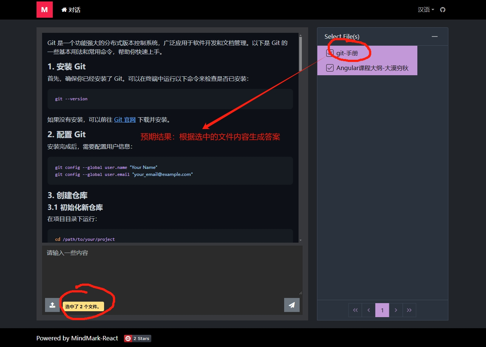

# MindMark-React

## 1.说明

此项目是 MindMark（心印）的前端代码。

服务端位于： https://gitee.com/mumu-osc/mind-mark

**请先启动服务端项目，然后启动此项目。**

## 2.启动项目

修改 webpack.dev.js 中的配置，把 proxy 指向 MindMark 后台服务。

```javascript
  proxy: {
      "/mind-mark": {
        "target": "http://localhost:9090", //修改这里，指向你的 MindMark 服务端接口
        "secure": false,
        "changeOrigin": true,
        "logLevel": "debug"
      }
    },
```

启动项目：

```shell

npm run start:dev-backend

```

与启动环境有关的配置项在 environment.\* 和 webpack.common.js 中。

## 3.屏幕截图



## 4.License

MIT

（补充声明：您可以随意使用此项目，但是本人不对您使用此项目造成的任何损失承担责任。）

## 5.联系我

VX: lanxinshuma
